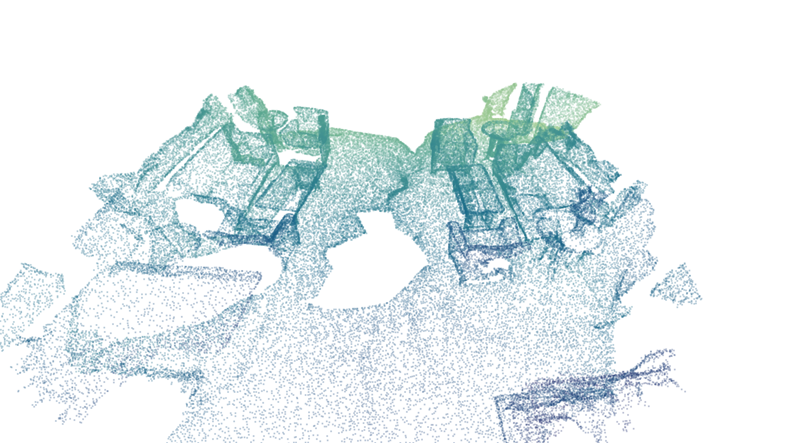
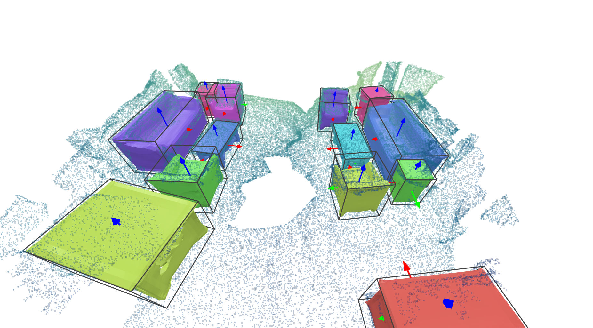
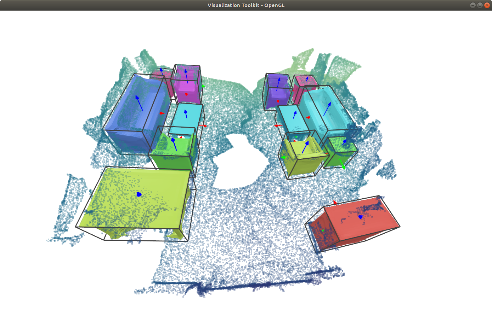
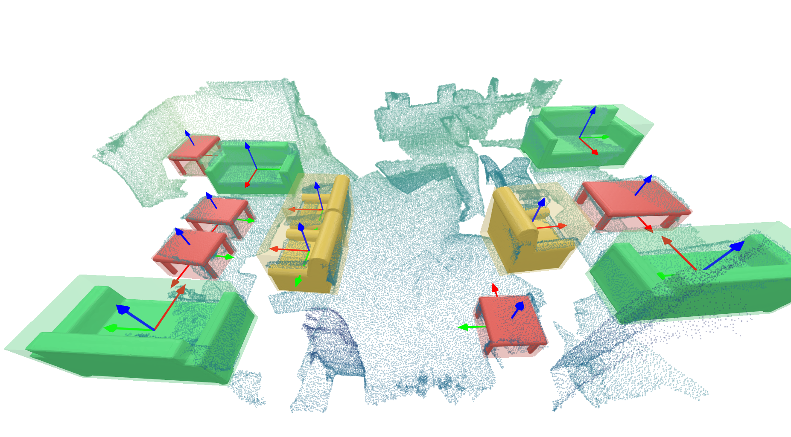
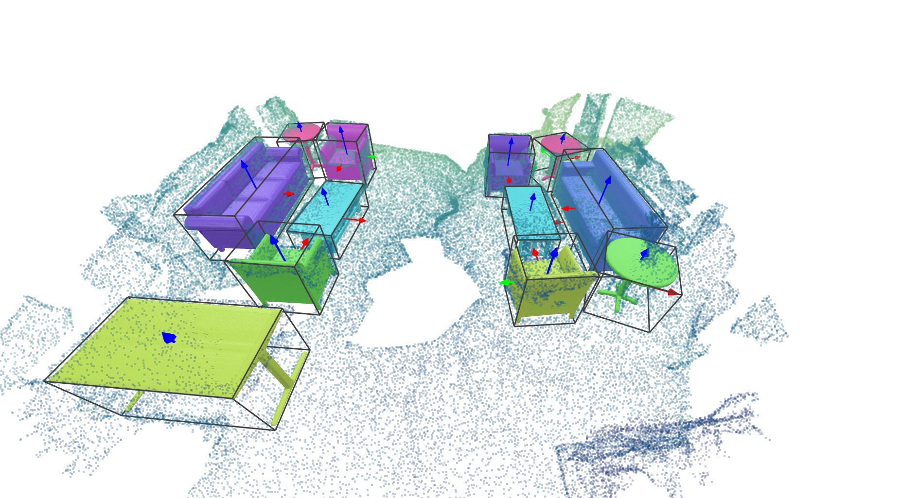

## RfD-Net [[Project Page]](https://yinyunie.github.io/RfDNet-Page/ ) [[Paper]](https://arxiv.org/abs/2011.14744) [[Video]](https://www.youtube.com/watch?v=RHHFC2UaZtQ)

**RfD-Net: Point Scene Understanding by Semantic Instance Reconstruction** <br>
[Yinyu Nie](https://yinyunie.github.io/), [Ji Hou](https://sekunde.github.io/), [Xiaoguang Han](https://mypage.cuhk.edu.cn/academics/hanxiaoguang/), [Matthias Nießner](https://niessnerlab.org/members/matthias_niessner/profile.html) <br>
In [CVPR, 2021](http://cvpr2021.thecvf.com/).


 

From an incomplete point cloud of a 3D scene (left), our method learns to jointly understand the 3D objects and reconstruct instance meshes as the output (right).

---

### Install
1. This implementation uses Python 3.6, [Pytorch1.7.1](http://pytorch.org/), cudatoolkit 11.0. We recommend to use [conda](https://docs.conda.io/en/latest/miniconda.html) to deploy the environment.
   * Install with conda:
    ```
    conda env create -f environment.yml
    conda activate rfdnet
    ```
    * Install with pip:
    ```
    pip install -r requirements.txt
    ```
   
2. Next, compile the external libraries by
    ```
    python setup.py build_ext --inplace
    ```
3. Install [PointNet++](https://github.com/erikwijmans/Pointnet2_PyTorch) by
    ```
   export CUDA_HOME=/usr/local/cuda-X.X  # replace cuda-X.X with your cuda version.
   cd external/pointnet2_ops_lib
   pip install .
    ```

---

### Demo
The pretrained model can be downloaded [here](https://livebournemouthac-my.sharepoint.com/:u:/g/personal/ynie_bournemouth_ac_uk/EcHBlVk4nfpEiXrEiBYkpEoBJJO1rjTioCNXRynTKmvHgQ?e=Z53UM7). Put the pretrained model in the directory as below

```
out/pretrained_models/pretrained_weight.pth
```
A demo is illustrated below to see how our method works.
```
cd RfDNet
python main.py --config configs/config_files/ISCNet_test.yaml --mode demo --demo_path demo/inputs/scene0549_00.off
```

[VTK](https://vtk.org/) is used here to visualize the 3D scenes. The outputs will be saved under 'demo/outputs'. You can also play with your toy with this script.

If everything goes smooth, there will be a GUI window popped up and you can interact with the scene as below.


You can also use the `offscreen` mode by setting `offline=True` in `demo.py` to render the 3D scene.
The rendered image will be saved in `demo/outputs/some_scene_id/pred.png`.

---

### Prepare Data
In our paper, we use the input point cloud from the [ScanNet](http://www.scan-net.org/) dataset, and the annotated instance CAD models from the [Scan2CAD](https://github.com/skanti/Scan2CAD) dataset.
Scan2CAD aligns the object CAD models from [ShapeNetCore.v2](https://shapenet.org/) to each object in ScanNet, and we use these aligned CAD models as the ground-truth.

##### Preprocess ScanNet and Scan2CAD data
You can either directly download the processed samples [[link](https://livebournemouthac-my.sharepoint.com/:u:/g/personal/ynie_bournemouth_ac_uk/EZjNNhRxcnBGlGo18ASb-xUBDP1gxkRGI5uO1foLl8v8Kg?e=yVXbfN )] to the directory below (recommended)
```
datasets/scannet/processed_data/
```
or <br>

1. Ask for the [ScanNet](http://www.scan-net.org/) dataset and download it to
   ```
   datasets/scannet/scans
   ```
2. Ask for the [Scan2CAD](https://github.com/skanti/Scan2CAD) dataset and download it to
   ```
   datasets/scannet/scan2cad_download_link
   ```
3. Preprocess the ScanNet and Scan2CAD dataset for training by
   ```
   cd RfDNet
   python utils/scannet/gen_scannet_w_orientation.py
   ```

##### Preprocess ShapeNet data
You can either directly download the processed data [[link](https://livebournemouthac-my.sharepoint.com/:f:/g/personal/ynie_bournemouth_ac_uk/EtFYCJNn1IdInSg2_QbVU1UB6BYW1sGI5y4D5u8eeaZffQ?e=CHqAyG )] and extract them to `datasets/ShapeNetv2_data/` as below
```
datasets/ShapeNetv2_data/point
datasets/ShapeNetv2_data/pointcloud
datasets/ShapeNetv2_data/voxel
datasets/ShapeNetv2_data/watertight_scaled_simplified
```
or <br>

1. Download [ShapeNetCore.v2](https://shapenet.org/) to the path below
   
    ```
    datasets/ShapeNetCore.v2
   ```
   
2. Process ShapeNet models into watertight meshes by
   
    ```
    python utils/shapenet/1_fuse_shapenetv2.py
   ```
   
3. Sample points on ShapeNet models for training (similar to [Occupancy Networks](https://github.com/autonomousvision/occupancy_networks)).
   
    ```
    python utils/shapenet/2_sample_mesh.py --resize --packbits --float16
   ```
   
4. There are usually 100K+ points per object mesh. We simplify them to speed up our testing and visualization by
   
    ```
    python utils/shapenet/3_simplify_fusion.py --in_dir datasets/ShapeNetv2_data/watertight_scaled --out_dir datasets/ShapeNetv2_data/watertight_scaled_simplified
   ```
   

##### Verify preprocessed data
   After preprocessed the data, you can run the visualization script below to check if they are generated correctly.
   
   * Visualize ScanNet+Scan2CAD+ShapeNet samples by
     
      ```
      python utils/scannet/visualization/vis_gt.py
      ```
     
      A VTK window will be popped up like below.
   
      

---
### Training, Generating and Evaluation
We use the configuration file (see 'configs/config_files/****.yaml') to fully control the training/testing/generating process.
You can check a template at `configs/config_files/ISCNet.yaml`.

#### Training
We firstly pretrain our **detection** module and **completion** module followed by a joint refining. You can follow the process below.

1. Pretrain the **detection** module by
   
   ```
   python main.py --config configs/config_files/ISCNet_detection.yaml --mode train
   ```
   It will save the detection module weight at
   `out/iscnet/a_folder_with_detection_module/model_best.pth`

2. Copy the weight path of detection module (see 1.) into `configs/config_files/ISCNet_completion.yaml` as
   ```
   weight: ['out/iscnet/a_folder_with_detection_module/model_best.pth']
   ```
   Then pretrain the **completion** module by
   ```
   python main.py --config configs/config_files/ISCNet_completion.yaml --mode train
   ```
   It will save the completion module weight at
   `out/iscnet/a_folder_with_completion_module/model_best.pth`
   
3. Copy the weight path of completion module (see 2.) into `configs/config_files/ISCNet.yaml` as
   ```
   weight: ['out/iscnet/a_folder_with_completion_module/model_best.pth']
   ```
   Then jointly finetune RfD-Net by
   ```
   python main.py --config configs/config_files/ISCNet.yaml --mode train
   ```
   It will save the trained model weight at
   `out/iscnet/a_folder_with_RfD-Net/model_best.pth`

#### Generating

Copy the weight path of RfD-Net (see 3. above) into `configs/config_files/ISCNet_test.yaml` as
   ```
   weight: ['out/iscnet/a_folder_with_RfD-Net/model_best.pth']
   ```
Run below to output all scenes in the test set.
   ```
   python main.py --config configs/config_files/ISCNet_test.yaml --mode test
   ```
The 3D scenes for visualization are saved in the folder of `out/iscnet/a_folder_with_generated_scenes/visualization`. You can visualize a triplet of (input, pred, gt) following a demo below
   ```
   python utils/scannet/visualization/vis_for_comparison.py 
   ```
If everything goes smooth, there will be three windows (corresponding to input, pred, gt) popped up by sequence as

| Input          |  Prediction | Ground-truth |
:-------------------------:|:-------------------------:|:-------------------------:
  |   |  

#### Evaluation
You can choose each of the following ways for evaluation.

1. You can export all scenes above to calculate the evaluation metrics with any external library (for researchers who would like to unify the benchmark).
   Lower the `dump_threshold` in `ISCNet_test.yaml` in generation to enable more object proposals for mAP calculation (e.g. `dump_threshold=0.05`).

2. In our evaluation, we voxelize the 3D scenes to keep consistent resolution with the baseline methods. To enable this, 
   1. make sure the executable [binvox](https://www.patrickmin.com/binvox/ ) are downloaded and configured as an experiment variable (e.g. export its path in ~/.bashrc for Ubuntu). It will be deployed by [Trimesh](https://trimsh.org/trimesh.exchange.binvox.html#trimesh.exchange.binvox.voxelize_mesh).
   
   2. Change the `ISCNet_test.yaml` as below for evaluation.
   ```
      test:
        evaluate_mesh_mAP: True
      generation:
        dump_results: False
   ```
   Run below to report the evaluation results.
   ```
   python main.py --config configs/config_files/ISCNet_test.yaml --mode test
   ```
   The log file will saved in `out/iscnet/a_folder_named_with_script_time/log.txt`

---

#### Differences to the paper
1. The original paper was implemented with Pytorch 1.1.0,
   and we reconfigure our code to fit with Pytorch 1.7.1.
2. A post processing step to align the reconstructed shapes to the input scan is supported. We have verified that it can improve the evaluation performance by a small margin.
   You can switch on/off it following `demo.py`.
3. A different learning rate scheduler is adopted.
   The learning rate decreases to 0.1x if there is no gain within 20 steps, which is much more efficient.
   

---

### Citation
If you find our work helpful, please consider citing
```
@InProceedings{Nie_2021_CVPR,
    author    = {Nie, Yinyu and Hou, Ji and Han, Xiaoguang and Niessner, Matthias},
    title     = {RfD-Net: Point Scene Understanding by Semantic Instance Reconstruction},
    booktitle = {Proceedings of the IEEE/CVF Conference on Computer Vision and Pattern Recognition (CVPR)},
    month     = {June},
    year      = {2021},
    pages     = {4608-4618}
}

```

---

### License
RfD-Net is relased under the MIT License. See the [LICENSE file](https://github.com/yinyunie/RfDNet/blob/main/LICENSE ) for more details.


   


   


